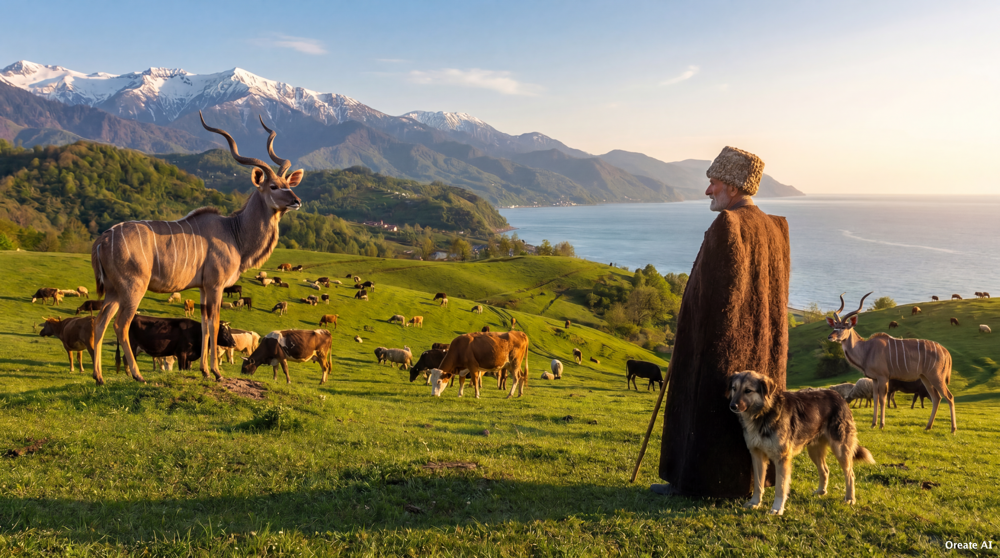
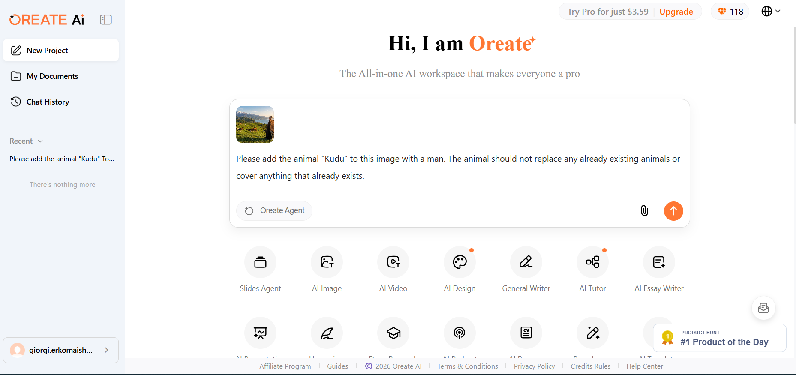
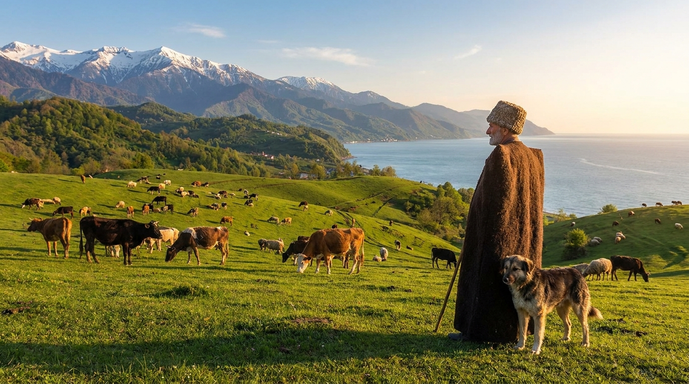
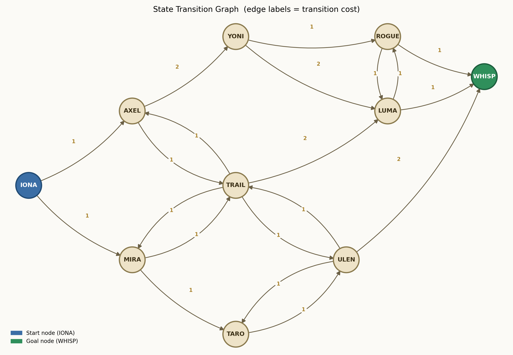

# Introduction to AI Final Exam

---

# Task 1 – Using Generative AI

The image below shows the generated result after adding a **Kudu** to the provided template image using Oreate AI.

---

# Task 2 – User Manual

# User Manual – Adding a Kudu to an Image Using Oreate AI

## Step 1 – Open Oreate AI

Open **https://www.oreateai.com**.

---

## Step 2 – Sign In

Click **Log In** and choose **Continue with Google**, 
licking "Continue with Google" both creates an account (if new) and signs you in.
Sign in using your university Google account.

---

## Step 3 – Upload the Image and Enter the Prompt

Upload **template.jpeg** and enter the following prompt:

> Please add the animal "Kudu" to this image with a man.
 The animal should not replace any already existing animals or cover anything that already exists.

Generate the image and wait for the result.

---

## Original Image

The original image before editing.

---

## Final Result

The generated image after adding the kudu.

---

# Task 3 – Graph Exploration

The graph below contains every reachable node and transition discovered while exploring the chatbot.

## Graph Summary

| Node | Available Transitions |
|------|------------------------|
| **IONA** | AXEL (1), MIRA (1) |
| **AXEL** | YONI (2), TRAIL (1) |
| **MIRA** | TARO (1), TRAIL (1) |
| **YONI** | ROGUE (1), LUMA (2) |
| **ROGUE** | WHISP (1), LUMA (1) |
| **LUMA** | WHISP (1), ROGUE (1) |
| **TRAIL** | AXEL (1), MIRA (1), LUMA (2), ULEN (1) |
| **ULEN** | TRAIL (1), TARO (1), WHISP (2) |
| **TARO** | ULEN (1) |
| **WHISP** | Goal node |

The graph includes all reachable nodes, transition weights, and cyclic paths discovered during the exploration.